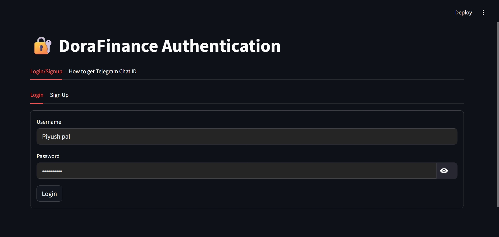
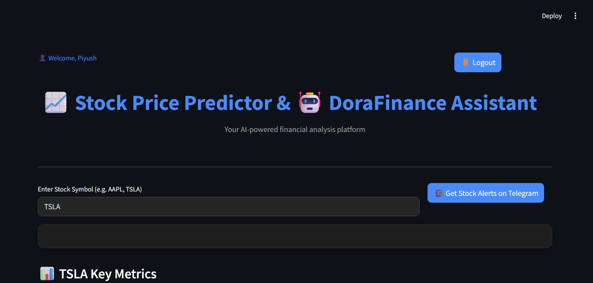
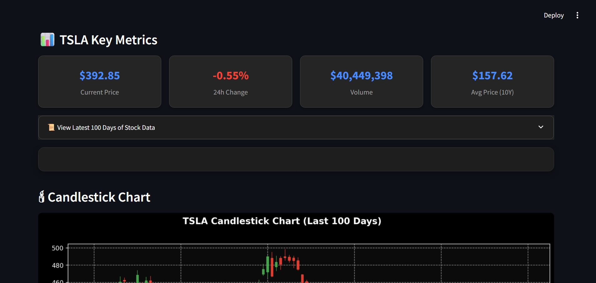
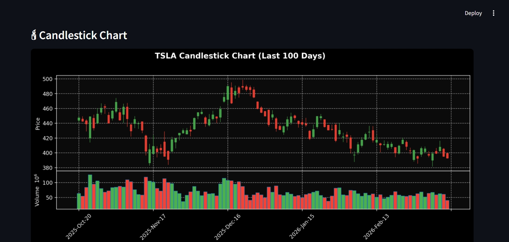
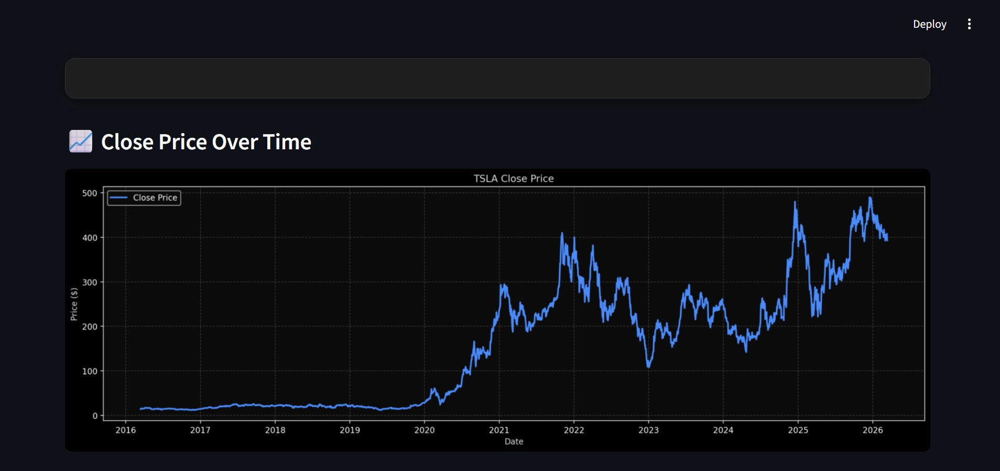
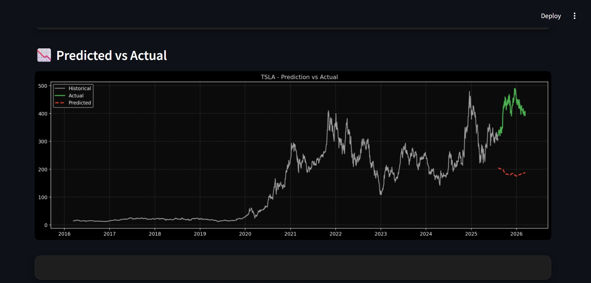
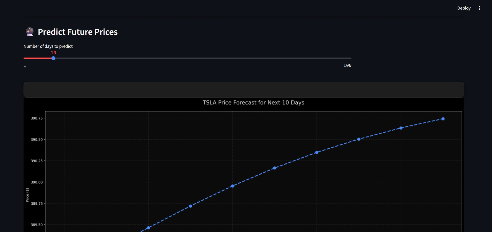
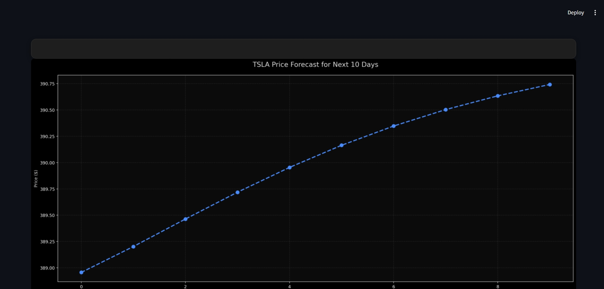
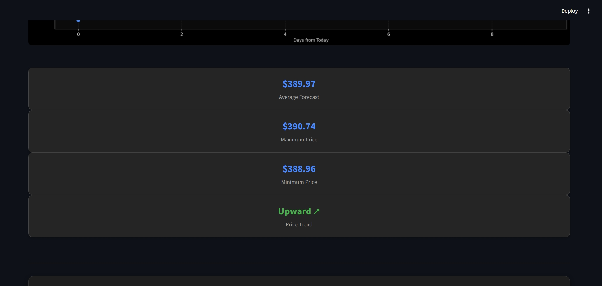
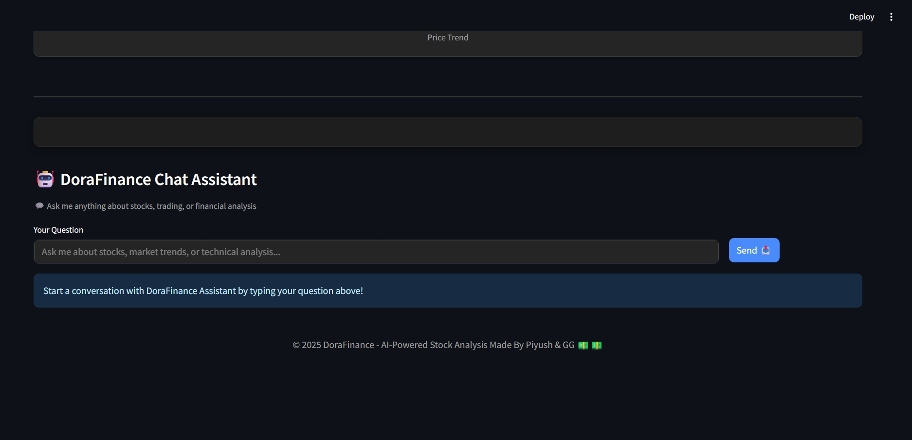

# 📈 Stock Price Predictor

A Machine Learning based web application that predicts stock prices
using historical stock market data. This project demonstrates how data
science and machine learning techniques can be used to analyze stock
trends and forecast future prices.

------------------------------------------------------------------------

# 🚀 Features

-   📊 Fetch historical stock price data
-   🤖 Machine Learning / Deep Learning based prediction model
-   📉 Visualization of stock price trends
-   📈 Comparison between actual vs predicted prices
-   🔍 Data preprocessing and feature engineering
-   🖥 Simple interactive interface for stock prediction

------------------------------------------------------------------------

# 🛠 Tech Stack

## Programming Language

-   Python

## Libraries Used

-   Pandas
-   NumPy
-   Matplotlib
-   Scikit-learn
-   TensorFlow / Keras
-   yfinance
-   Streamlit (optional)

## Tools

-   Jupyter Notebook
-   Git & GitHub
-   VS Code

------------------------------------------------------------------------

# 📂 Project Structure

    Stock-Price-Predictor
    │
    ├── Stock_Market_Prediction_Model_Creation.ipynb
    ├── Stock Predictions Model.keras
    ├── app.py
    ├── requirements.txt
    ├── StockPriceProject.txt
    └── README.md

# 📸 Project Demo

------------------------------------------------------------------------

# ⚙️ Installation Guide

## 1️⃣ Clone the repository

    git clone https://github.com/Piyushpal017/Stock-Price-Predictor.git
    cd Stock-Price-Predictor

## 2️⃣ Create Virtual Environment

    python -m venv venv

### Activate Environment

Windows

    venv\Scripts\activate

Linux / Mac

    source venv/bin/activate

## 3️⃣ Install Dependencies

    pip install -r requirements.txt

------------------------------------------------------------------------

# ▶️ Running the Project

Run the application using:

    python app.py

or (if using Streamlit)

    streamlit run app.py

------------------------------------------------------------------------

# 📊 How the Model Works

1.  Historical stock data is collected using Yahoo Finance API.
2.  The dataset is cleaned and preprocessed.
3.  Data is scaled using MinMaxScaler.
4.  A machine learning / deep learning model (LSTM) is trained on the
    dataset.
5.  The trained model predicts future stock prices based on previous
    patterns.

------------------------------------------------------------------------

# 📸 Example Output

The system generates:

-   Stock price charts
-   Moving averages
-   Predicted future prices
-   Actual vs predicted price comparison graphs

------------------------------------------------------------------------

# 🎯 Learning Outcomes

Through this project I learned:

-   Data preprocessing and visualization
-   Time series forecasting
-   Machine Learning & Deep Learning models
-   Building end-to-end ML projects
-   Creating interactive data science applications

------------------------------------------------------------------------

# 🔮 Future Improvements

-   Add real-time stock prediction
-   Deploy using Streamlit Cloud / Render
-   Add multiple stock comparison
-   Improve model accuracy
-   Add advanced ML models

------------------------------------------------------------------------

# 🤝 Contributing

Contributions are welcome!

Steps: 1. Fork the repository 2. Create a new branch 3. Commit your
changes 4. Submit a Pull Request

------------------------------------------------------------------------

# 📜 License

This project is licensed under the MIT License.

------------------------------------------------------------------------

# 👨‍💻 Author

**Piyush Pal**

GitHub: https://github.com/Piyushpal017
